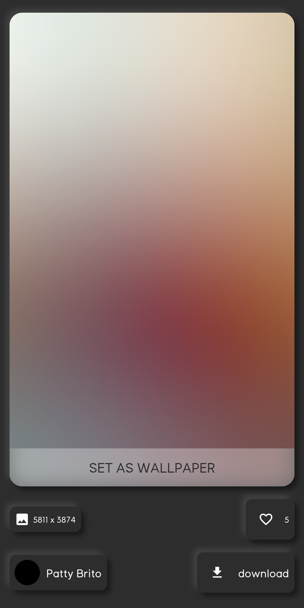

### Hi there, I'm Anurag Soni 👋
________________________________

### Screenshots

|  |  |  |
| ---------------------------------- | ---------------------- | ---------------------- |
|  |  |  |
| ---------------------------------- | -----------------------| -----------------------| 
|  |  |  |

 

### Before using this you must go to **unsplash** website and get an API Accesskey for yourself.
### Then go to lib/tabs/cardlist.dart and lib/tabs/newcardlist.dart and change **data/api_data** to your api Acceesskey.

 

## I'm a Student!

- 🔭 I’m currently studying in Indian Institute of International Technology Bhopal (india).

### Connect with me:

[][twitter]
[][linkedin]
[][instagram]

 

### Languages and Tools:

 
 

  
:zap: Github Stats

  

 

[twitter]: https://twitter.com/Anurags300
[instagram]: https://instagram.com/anurag____soni
[linkedin]: https://www.linkedin.com/in/anurag-soni-510271181/
